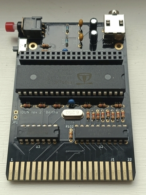
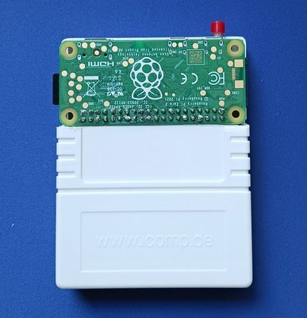
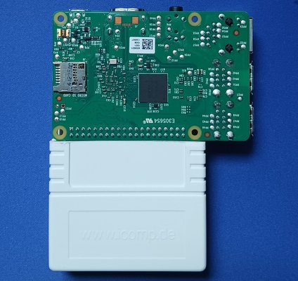
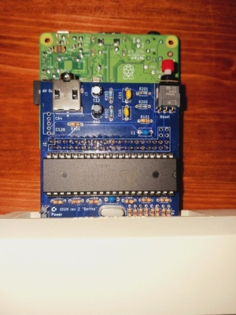
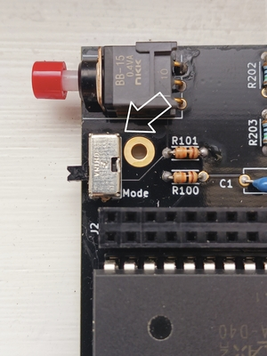

## Idun for the Commodore 128

This is the home of the idun-cartridge for the C128. Here you will find the latest software, along with source code, sample applications, and other content.

What does it do? Hopefully a [demo](https://www.youtube.com/watch?v=X_DMMz55Tpo) is worth a thousand words.

I've also just created (January 5, 2024) a [Discord Server](https://discord.gg/6Du9jhK4eF) for the project. This is for idun-project discussion, new user advice, and beta testing new features.

### Hardware

The idun-cartridge uses a Propeller 1 micro-controller to provide a fast hardware interface between the C128 and a Raspberry Pi ("RPi") that runs a customized Linux OS. The cartridge is designed to work and fit best with the Raspberry Pi Zero 2. However, any recent Raspberry Pi can be made to work.

The first set of photos show the idun-cartridge with RPi Zero 2 fitted. As you can see, a standard-sized C64/128 cartridge case can be hacked to cover the board, but leave the RPi, ports, and button accessible.

 A Model B RPi will also fit on an idun-cartridge, as this photo shows. For both Model Zero and Model B, the RPi is fitted on top of the idun-cartridge and upside-down. For the Model B, a case or other support is essential because of the weight.

You can also fit a Model A RPi, but the headers must be relocated to the opposite side of both the idun-cartridge PCB and the RPi itself. In this case, the RPi will be on the bottom (under the idun-cartridge), as shown here connected to a flat C128.

#### Partial Support for original Pi Zero

The original Pi Zero is nearing end-of-life, being phased out by the Raspberry Pi Foundation in favor of the more powerful Pi Zero 2. Because of this, some ARM Linux disributions are discontinuing support, making it difficult for the idun-cartridge to continue supporting the Pi Zero. However, the current state of affairs is that the Pi Zero is widely available and very inexpensive, and this could remain the case for the next year-or-so.

In light of the above, the Pi Zero is *partially* supported. You can download a compatible [image file](https://drive.google.com/file/d/1-f4fZqi1PGydYXPUaHLZCb5UNGgmPkZW/view?usp=sharing) that includes v1.2 of the software. All features are present on this image *except* for the `idunSID` remote SID player software (it requires a newer `glibc` library) and the Z80 programming support.

### Support the project

The best way to support the project is to [buy a hardware kit](https://www.tindie.com/products/idun-cartridge-c128/idun-cartridge-c128-kit/) from the online store. The kit comes with everything needed to assemble the idun-cartridge, except for the Raspberry Pi, which you will need to obtain yourself. Only basic soldering skills are needed, since the PCB is strictly through-hole components.

### Quick start

#### Download SD Image

You can download the customized Arch Linux OS image and flash it to a microSD card.

1. Ensure you have a suitable SD card compatible with your Raspberry Pi and at least 4GB (recommend 16 GB).
2. [Download Image](https://drive.google.com/file/d/1tYmL1zDgZj2KxWQS5eT54sy9L9NNPKM7/view?usp=sharing)
3. Use [Raspberry Pi Imager](https://www.raspberrypi.com/software/) or a similar program to write image to SD card.

Your microSD is now ready to use with your idun-cartridge. To expand the file system or setup networking, follow the additional instructions in [setup-rpi.md](doc/setup-rpi.md).

#### Power

It is recommended that you power the RPi externally from a USB power supply. The jumper (JP1) that allows power to come from the C128 is not installed by default, and only suited for the RPi Zero 2. Even then, it makes it too easy to turn off the C128 and Raspberry Pi without first shutting it down via the button. Plus, it is nice to be able to access the cartridge using the web filebrowser, emulation, or `ssh` while the C128 is switched off.

#### Cartridge Mode & Reset

The idun-cartridge has a single "big red button" with dual use. Press and release immediately to Reset everything, including rebooting your C128. Press and hold for at least 3 seconds to shutdown your cartridge, which is necessary before powering down.

As of release v1.1.0, the idun-cartridge has two different modes, controlled by the setting of the Mode toggle switch. When the switch is "Off" (i.e. not switched to the "Mode" position), the idun-cartridge loads the usual software stack. However, when switched to "Mode", a different software stack is selected as specified by the [mode] settings in the configuration file.

With the default configuration file settings, setting the switch to the "Mode" position enables "C64 Arcade Mode". This means the C128 is booted into C64 mode and the "arcade.app" game selector software is automatically loaded. This provides a very convenient way to quickly load and run C64 games on the C128.

#### Networking and Managing Files

It's well worth connecting your cartridge to your LAN. Convenient file management can be done through the web-based idun-filebrowser at `idunpi:8080`; it even includes remote file editing and drag&drop. Linux terminal access is also there using an `ssh` client from any computer. Additionally, you can [stream SID tunes](https://youtu.be/EPf45QN3PJk) and [setup file sharing](https://youtu.be/NZajjJ2tERM) with a Windows computer.

#### Emulating the Cartridge

You can also run [idun-vice](https://github.com/idun-project/idun-vice) to experiment with the idun-cartridge software WITHOUT any actual cartridge; just running everything off of the Raspberry Pi.

### Configuration

Configuration options are available in `$HOME/.config/idunrc.toml`. There is documentation within that file, but the following hints are also helpful.

1. Because of the "special" VDC hi-res graphic modes used by some of the software (e.g. `showvdc`), it is very important to set the correct amount of VRAM in the configuration file to either 16kB or 64kB, as appropriate. The setting is the second parameter in the `[vdc]` section.
2. Some monitors are picky about how many rows of text they can display in 80 column mode, and how they look when displaying text in interlaced mode. The default is 27 rows, non-interlaced. You can modify this by changing the first parameter in the `[vdc]` section, and for interlaced text, the section `[vdc_interlace]`. Also take a look at the `mode` command for changing the number of text rows on demand (not to be confused with the mode switch described above).
3. If you are using the software with only a Raspberry Pi and Vice (no idun-cartridge hardware), then pay careful attention to disable the configuration file from trying to connect with hardware that isn't there. For details, see the [README for idun-vice](https://github.com/idun-project/idun-vice).

### Building C128 code

The idun-cartridge software in this repository is self-hosting. All of the assembly code is built with the `acme` cross-assembler and everything you need to build and modify it can be done on the cartridge itself. You can perform each of these steps from the Linux prompt:

1. Clone this repository to your idun home directory: `git clone https://github.com/idun-project/idun-cartridge`
2. `cd idun-cartridge && ./setup.sh` -installs additional packages such as acme and idun-zcc.
3. `cd cbm && make` -builds cartridge software and updates the `sys` directroy (`z:` device in the idun-shell)

See the [Makefile](cbm/Makefile) for details.

### Programming applications

The idun-cartridge works with many legacy applications. Single-file loaders in particular work very well and load instantly in either C128 or C64 mode. But the point is to enhance both the user and programmer experience with applications that integrate into the idun-cartridge. There are currently 3 well-supported ways to create software for the idun-cartridge.

#### 6502 Assembly

This repository includes the acme 6502 cross-assembler, which can be used to build both the contents of this repo and your own programs on the idun-cartridge. You should first decide whether to build a Tool or an App.

1. Tools load from the idun-shell using $6D00-$BFFF, have access to the [kernel api](doc/apiref.md) and the [toolbox](doc/toolbox.md), and return the user to the idun-shell on exit. They are typically command-line style programs, but can also take over the screen and run interactively. Many examples can be found in the [cmd](cbm/cmd/) sub-directory
2. An App is launched by the kernel at startup using $6000-$BFFF, has access to the kernel API, but not the toolbox _unless_ `sys/toolbox.asm` is explicitly included, and return to BASIC, or not at all. They typically take over the machine and reconfigure the hardware as needed. Examples are `dos.app` (the idun-shell) and `arcade.app` (the arcade game selector).

It is certainly possible to use other assemblers besides acme; just requiring that the header files `acehead.asm` and `toolhead.asm` be ported over to your environment.

#### Lua Scripting

The idun software running on the Raspberry Pi embeds a Lua scripting engine. This allows you to create either Tools or Apps in which much, even a majority of the functionality, is implemented in Lua.

Begin by reading [luaref.md](doc/luaref.md). There is sample Lua App code in [samples](samples/), and the [arcade.app](cbm/arcade.app.d/main.lua) is Lua. These can serve as a template for creating your own Lua App.

 _NOTE: There is a forthcoming tool called `idunc` that will generate new Lua Apps from a template, including all the boiler-plate needed._

#### C and Z80 Assembly 

You can create programs that run on the Z80! They launch seamlessly from the idun-shell, and return to it on exit. These are more akin to Apps than Tools, except for their use of the `zload` command and launching from the idun-shell. The programs can be written in a mixture of C and Z80asm code, and can be built directly on the idun-cartridge. For more information, browse to the [idun-zcc](https://github.com/idun-project/idun-zcc) repository.

### Trivia

[Idun](https://en.wikipedia.org/wiki/I%C3%B0unn) is the [Norse goddess](https://youtu.be/0IIcDB3noxE?t=308) of youth and [rejuvenation](https://youtu.be/GiXNEf_NOak).
