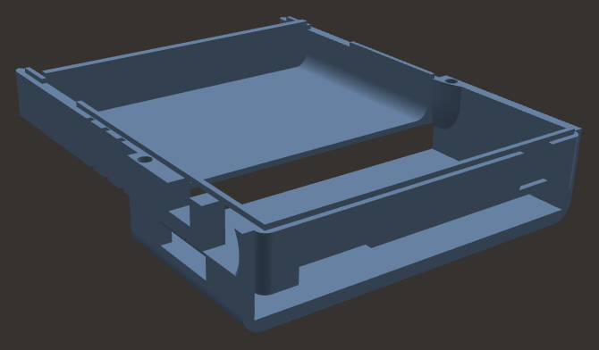
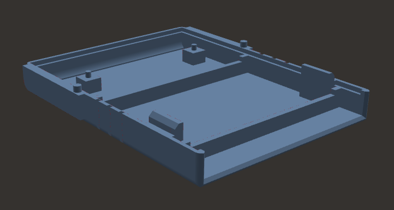

This case design is suitable for 3D printers and was generously contributed by one of our users. This design  is [Licensed under Creative Commons](LICENSE).

There are two main pieces which can be press-fit together; so no screws are required. There's also a replacement button cap that makes the reset button easier to press with the case installed.

